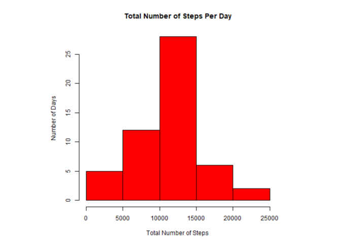
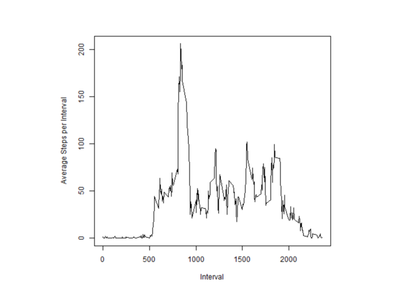
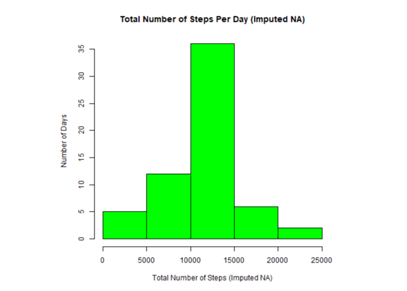
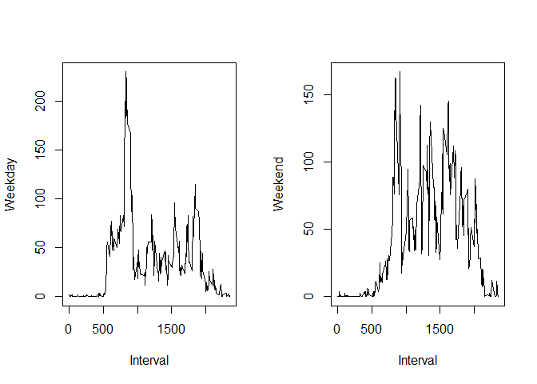

## Loading and preprocessing the data


```r
## installs and loads packages(if not yet installed)
if(!require(png)){
  install.packages("png")
  library(png)
}
```

```
## Loading required package: png
```

```r
if(!require(plyr)){
  install.packages("plyr")
  library(plyr)
}
```

```
## Loading required package: plyr
```

```r
if(!require(dplyr)){
  install.packages("dplyr")
  library(dplyr)
}
```

```
## Loading required package: dplyr
```

```
## 
## Attaching package: 'dplyr'
```

```
## The following objects are masked from 'package:plyr':
## 
##     arrange, count, desc, failwith, id, mutate, rename, summarise,
##     summarize
```

```
## The following objects are masked from 'package:stats':
## 
##     filter, lag
```

```
## The following objects are masked from 'package:base':
## 
##     intersect, setdiff, setequal, union
```

```r
library(png)
library(plyr)
library(dplyr)


### Downloads the source file if it is not in the current working directory, proceeds if it is 
destfilecsv = "./activity.csv" 
destfilezip = "./repdata_data_activity.zip"
fileURL <- "https://d396qusza40orc.cloudfront.net/repdata%2Fdata%2Factivity.zip"
if(!file.exists(destfilecsv)){
  download.file(fileURL, destfile="./repdata_data_activity.zip", method="auto")
  unzip("./repdata_data_activity.zip")
}

### Reads data
  
  activity<-read.csv("./activity.csv",header = TRUE)
  activity[,2]<-as.Date(activity$date)
  
  summary(activity)
```

```
##      steps             date               interval     
##  Min.   :  0.00   Min.   :2012-10-01   Min.   :   0.0  
##  1st Qu.:  0.00   1st Qu.:2012-10-16   1st Qu.: 588.8  
##  Median :  0.00   Median :2012-10-31   Median :1177.5  
##  Mean   : 37.38   Mean   :2012-10-31   Mean   :1177.5  
##  3rd Qu.: 12.00   3rd Qu.:2012-11-15   3rd Qu.:1766.2  
##  Max.   :806.00   Max.   :2012-11-30   Max.   :2355.0  
##  NA's   :2304
```

```r
  head(activity)
```

```
##   steps       date interval
## 1    NA 2012-10-01        0
## 2    NA 2012-10-01        5
## 3    NA 2012-10-01       10
## 4    NA 2012-10-01       15
## 5    NA 2012-10-01       20
## 6    NA 2012-10-01       25
```

## What is mean total number of steps taken per day?


```r
## creates the plot according to specifications
 
  daysteps<-aggregate(steps~date, activity, sum)
  
  png("plot1.png", width=480, height=480)
  plot1 <- hist(daysteps$steps, xlab="Total Number of Steps", ylab="Number of Days", main="Total Number of Steps Per Day",col="Red", freq = TRUE)
  dev.off()
```

```
## png 
##   2
```

```r
## previews the plot1.png file in r 
  img <- readPNG("./plot1.png")
  grid::grid.raster(img)
```

<!-- -->

```r
## shows mean and median
  meansteps <- mean(daysteps$steps)
  mediansteps <- median(daysteps$steps)
  
  meansteps
```

```
## [1] 10766.19
```

```r
  mediansteps
```

```
## [1] 10765
```


## What is the average daily activity pattern?


```r
## interval steps
  meanstepsint<-aggregate(steps~interval, activity, mean)
  png("plot2.png", width=480, height=480)
  plot2 <- with(meanstepsint, plot(interval, steps, type = "l", ylab="Average Steps per Interval", xlab="Interval"))
  
## previews the plot2.png file in r 
  dev.off()
```

```
## png 
##   2
```

```r
  img2 <- readPNG("./plot2.png")
  grid::grid.raster(img2)
```

<!-- -->

```r
## Interval with the highest average steps
meanstepsint[which.max(meanstepsint[,2]),1]  
```

```
## [1] 835
```

## Imputing missing values


```r
# Number of NAs in Dataset
sum(is.na(activity$steps))
```

```
## [1] 2304
```

```r
impute.mean <- function(xyz) replace(xyz, is.na(xyz), mean(xyz, na.rm = TRUE))
activity2 <- ddply(activity, ~ interval, transform, steps = impute.mean(steps))

activity2 <- activity2[order(activity2$date), ] #plyr orders by group so we have to reorder

head(activity2)
```

```
##         steps       date interval
## 1   1.7169811 2012-10-01        0
## 62  0.3396226 2012-10-01        5
## 123 0.1320755 2012-10-01       10
## 184 0.1509434 2012-10-01       15
## 245 0.0754717 2012-10-01       20
## 306 2.0943396 2012-10-01       25
```

```r
## creates the plot3 according to specifications
 
  daysteps2<-aggregate(steps~date, activity2, sum)
  
  png("plot3.png", width=480, height=480)
  plot3 <- hist(daysteps2$steps, xlab="Total Number of Steps (Imputed NA)", ylab="Number of Days", main="Total Number of Steps Per Day (Imputed NA)",col="Green", freq = TRUE)
  dev.off()
```

```
## png 
##   2
```

```r
# previews the plot3.png file in r 
  img3 <- readPNG("./plot3.png")
  grid::grid.raster(img3)
```

<!-- -->

```r
  dev.off()
```

```
## null device 
##           1
```

```r
# shows new mean and median
  
  ## shows mean and median
  meansteps2 <- mean(daysteps2$steps)
  mediansteps2 <- median(daysteps2$steps)
  
  meansteps2
```

```
## [1] 10766.19
```

```r
  mediansteps2
```

```
## [1] 10766.19
```

## Are there differences in activity patterns between weekdays and weekends?


```r
activity3 <- mutate(activity2, weektype = ifelse(weekdays(activity2$date) == "Saturday" | weekdays(activity2$date) == "Sunday", "weekend", "weekday"))
activity3$weektype <- as.factor(activity3$weektype)

actweekday <- subset(activity3, weektype == "weekday")
actweekend <- subset(activity3, weektype == "weekend")

forweekday<-aggregate(steps~interval, actweekday, mean)
forweekend<-aggregate(steps~interval, actweekend, mean)

par(mfrow=c(1,2))
with(forweekday, plot(interval, steps, type = "l", ylab="Weekday", xlab="Interval"))

with(forweekend, plot(interval, steps, type = "l", ylab="Weekend", xlab="Interval"))
```

<!-- -->
